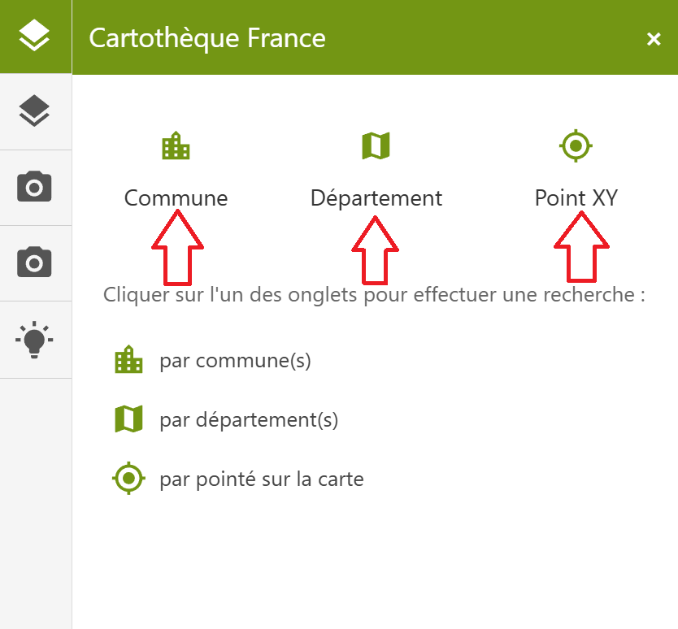
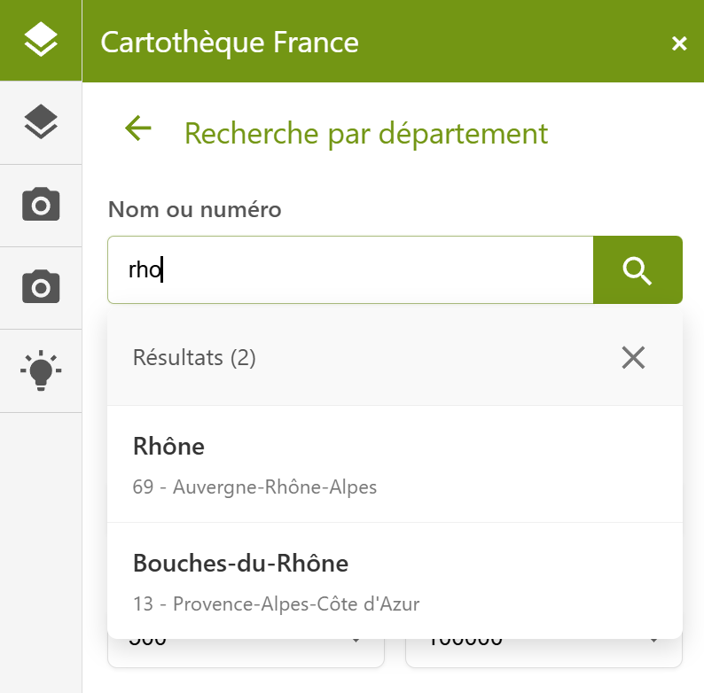
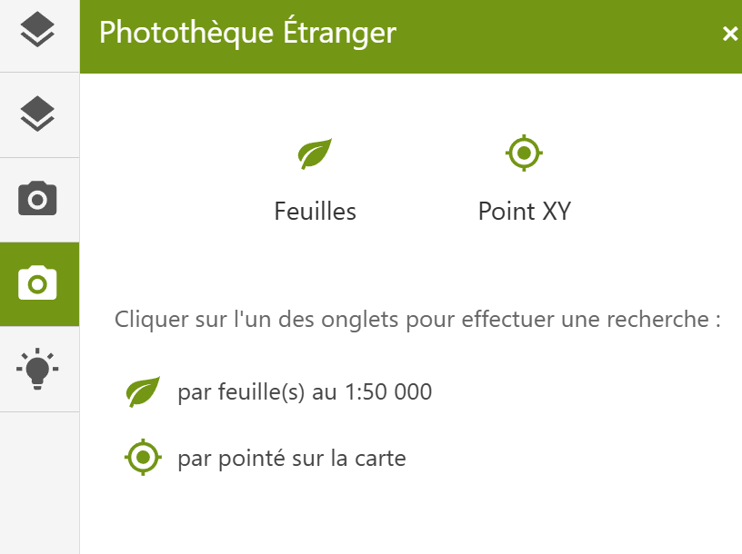

# Guide Utilisateur - Géothèque IGN

## Présentation

Le **Géothèque** est un outil réservé aux agents de l’IGN. Il est utilisé pour répondre aux demandes de personnes extérieures concernant deux types de données :

- Les **cartes anciennes**
- Les **photographies** anciennes ou récentes

Ces données peuvent provenir de **France** ou de **l’étranger**.

---

## 1. Cartes Anciennes - France

### Étapes de recherche

1. **Sélectionner le menu** : `Cartothèque France`
2. **Définir la zone de travail** via :
   - **Commune** : rechercher par nom
   - **Département** : rechercher par nom
   - **Pointé** : cliquer sur la carte

> Pour les zones `Commune` et `Département`, tapez le nom dans la barre de recherche, puis sélectionnez dans la liste déroulante. 

> Pour la zone `Pointé`, cliquez sur l'emplacement désiré sur la carte, ou saisissez manuellement les coordonnées (Lambert 93, WGS84, Web Mercator).

### Affiner la recherche (facultatif)

- **Année** : saisir une année minimale et/ou maximale
- **Échelle** : définir une échelle minimale et/ou maximale
- **Collection** : sélectionner dans la liste déroulante

### Résultats

- Export possible au format **CSV**, avec les informations suivantes :
  - `id`
  - `libellé`
  - `année`
  - `couleur`
  - `type`

- Possibilité de sélectionner une carte pour :
  - La **visualiser** dans une nouvelle fenêtre
  - La **télécharger**
  - Visualiser le **fichier XML** associé

### Visualisation

Dans la fenêtre de visualisation :
- Zoom / Dézoom
- Rotation
- Réglage de la **luminosité** et du **contraste**

---

## 2. Cartes Anciennes - Étranger

Le fonctionnement est similaire à celui de la **cartothèque France**, avec les différences suivantes :

- **Commune** → remplacée par **Feuille**
- **Département** → remplacé par **Pays**

---

## 3. Photographies - France

### Sélection de la zone de travail

L'utilisateur peut choisir parmi :
- **Commune**
- **Département**
- **Feuille**
- **Point XY**
- ou effectuer une recherche **par nom de mission**

### Affiner la recherche (facultatif)

- **Commanditaire** : saisie manuelle + sélection dans liste déroulante
- **Producteur** : idem
- **Support** et **Émulsion** : sélection dans liste déroulante

### Sélection de la mission

Une fois la mission choisie, l'utilisateur peut :
- Visualiser les informations :
  - `Désignation`
  - `Dispo Photothèque`
  - `Échelle`
  - etc.

- Option : **Voir plus de détails** permet l'ensemble des informations de la mission.

### Fonctions supplémentaires

- Ajouter les **emprises photos** sur la carte
- Supprimer des emprises individuelles ou toutes les emprises
- Télécharger le **CSV** associé
- Visualiser le **XML** de la mission
- Se déplacer vers l’emplacement de la mission

### Panier

- Passer sa souris au dessus d'une croix rouge affiche l'emprise de la photo ainsi que les informations de la photo

- Cliquer sur le **centre des photos** permet de les ajouter au panier

- Depuis le panier :
  - Visualiser la photo
  - Télécharger la photo
  - Supprimer la photo

---

## 4. Photographies - Étranger

Fonctionnement similaire à la **photothèque française**, avec une différence :

- Seules deux options disponibles pour définir la zone de travail :
  - **Feuille**
  - **Point XY**

---

## 5. Bonus

### Raccourci

- Vous pouvez utiliser le raccourci pour vous déplacer dans un lieu précis sur la carte.

### Changement de fond de carte

- Vous pouvez changer le fond de carte en sélectionnant le fond de carte souhaité dans la fenêtre volante dans le coin en bas à droite.

### Ajout de couche vectorielle

- Vous pouvez ajouter une couche vectorielle dans la fenêtre volante dans le coin en bas à droite.

### Cacher le fond de carte

- Vous pouvez cacher le fond de carte en cliquant sur l'icone en forme d'oeil en haut à droite.

